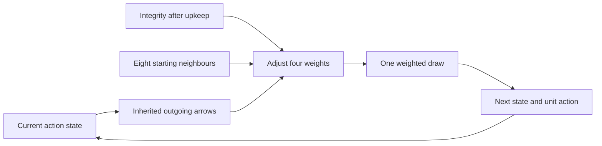
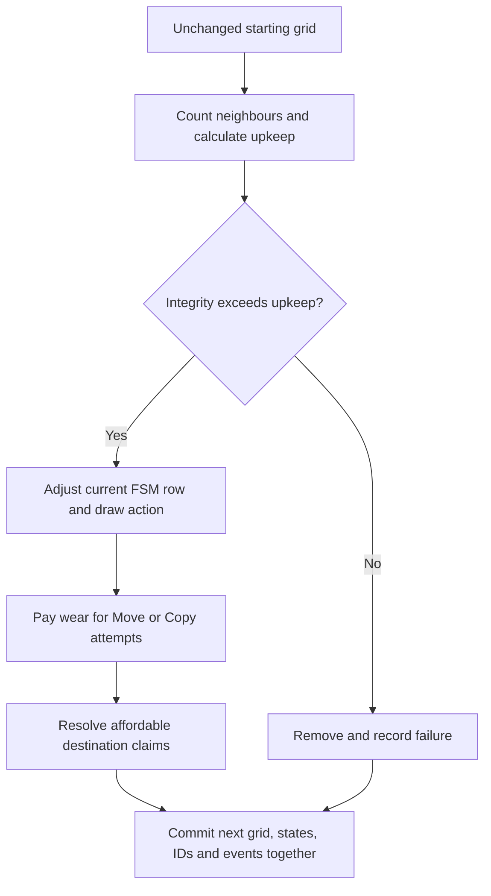

# VirtualLife model

**Accepted model:** inherited probabilistic finite-state machines are the sole autonomous strategy. The default population uses the four FSM presets. Flat action-weight policies and random removal are retired. The explicit scripted demo remains an engine regression fixture; it is not evidence of emergence.

## Individuals and the world

An agent is an individual, with a stable ID, inherited graph, current integrity and last selected action. Biological species or roles are interpretations of observed behaviour, not classes with separate code. Resources may eventually be represented by individuals with different properties; no separate resource or energy layer exists now.

The world is a rectangular grid with wraparound edges and eight immediate neighbours. Dimensions are at least 3, so neighbours are distinct. A square holds at most one individual. Updates are synchronous: everyone consults the same starting grid, and newborns first act on the following tick. Observation never changes the simulation.

## Probabilistic unit-action automata

**11 September 2026 — Pierre's decisions:** use Wait, Move, Copy and Repair as states, with inherited outgoing arrows that can differ by source state. Missing arrows and certain transitions are allowed. Recompute preferences each tick from the individual's properties and local environment. Repair must follow integrity smoothly, without a repair threshold. Types differ through inherited graphs and response parameters; no type-specific code or species hierarchy is introduced.

Each graph holds an initial state, four rows of four nonnegative integer weights, a Copy damage gain and a Move crowding gain (both 0–255). Every inherited row must contain a positive weight. Initial agents and newborns use the inherited initial state's row but have not yet acted. Thereafter the last selected action selects the row, including rejected Move/Copy attempts. One draw chooses the next state and its unit action in the same tick. Offspring inherit the whole graph and response parameters, receive fresh maximum integrity and no selected action, and first act next tick. Exact inherited graphs, initial state and response parameters define groups; current integrity and action state do not.

After the mandatory upkeep check, let `d` be missing integrity as a fraction of maximum, `n` occupied neighbours out of eight, and `(W,M,C,R)` the current inherited row. The conceptual weights are:

| Next action | Adjusted relative weight |
|---|---|
| Wait | `W + (n/8) × C × (1 + copy_gain × d)` |
| Move | `M × (1 + move_gain × n/8)` |
| Copy | `C × (1 + copy_gain × d) × (1 − n/8)` |
| Repair | `R × d` |

Normalize these four values to obtain probabilities. Repair weight is zero at full integrity and grows with damage on **every** incoming arrow, including its self-loop. A row containing only Repair still selects Repair with certainty when damaged: normalization matters. Strong Copy responses can compete with Repair as integrity falls, so larger Repair weight does not by itself guarantee a larger final probability against every competing response. The engine still permits costly attempts that can fail; these rules do not make agents optimally cautious.

Implementation uses integer tickets: `D = ceil(1000 × (maximum − integrity_after_upkeep) / maximum)`. This is a smooth response sampled to 1000 parts, with upward error below 0.001 and any positive damage retained. Set `C' = C × (1000 + copy_gain × D)`; tickets are `(8000W + nC', 1000M(8 + move_gain×n), (8−n)C', 8RD)`. Their total is below `2^54` even at maximal supported parameters. Draw once below the total. If all effective weights are zero, use Wait with certainty and store Wait as the selected state. Crowding's existing Copy-to-Wait transfer and this no-choice fallback can produce Wait even without an inherited Wait arrow; the live diagram includes these conditional arrows.

Example: from Repair, row `(0,3,1,6)`, no response gains and empty surroundings. At integrity 8/10 **after upkeep**, tickets are `(0,24000,8000,9600)`: Move ≈57.7%, Copy ≈19.2%, Repair ≈23.1%. At 5/10 they become `(0,24000,8000,24000)`: Move ≈42.9%, Copy ≈14.3%, Repair ≈42.9%. At full integrity Repair is zero. No threshold switches it on.

Illustrative presets, all initially in Wait:

| Preset | Characteristic graph / response |
|---|---|
| Movement runs | Move can repeat; crowding gain 2 increases movement; Copy leads to Repair. |
| Repair cycles | Wait, Move and Copy each lead only to Repair; Repair can lead to any state. |
| Copy bursts | Copy can repeat; Copy damage gain 2 gives multiplier `1 + 2d`. |
| Wait cycles | Wait can repeat; Repair sometimes leads to Move or Copy; Move leads to Wait. |

Exact rows are in `src/automaton.rs` and exposed in CLI metadata and browser diagrams. These are starting hypotheses, without a coexistence or survival guarantee. `unit-action automaton v1` identifies this sampling protocol.

**Near-term model priority:** mutation during copying, so new inherited types can arise beyond the starting presets. Pierre explicitly wants this soon. It is not implemented here; mutation rate, size, allowable graph changes, and how to display growing diversity need a separate model decision. **Later exploration:** longer-lived behaviour modes (for example roaming and recovery) which can each perform multiple unit actions. The current implementation keeps unit actions as states.

## Tick execution and survival

Shared maintenance defaults are maximum integrity 10, base upkeep 1, extra crowding upkeep 1 when at least five starting neighbours are occupied, Move wear 1, Copy wear 2, and gross Repair 4. These settings are illustrative, not calibrated biology. A threshold exists for **crowding upkeep**, not for Repair probability.

Effective upkeep is `base + (occupied >= crowding_threshold ? crowding_upkeep : 0)`. Individuals with integrity less than or equal to upkeep fail before choice, with no random draws. Otherwise subtract upkeep, then select the FSM action:

- **Wait:** no further change.
- **Move / Copy:** draw a target uniformly among all eight neighbours before testing affordability. Integrity must exceed extra wear; otherwise remove the individual, with no destination claim or new ID. Affordable attempts pay wear even if occupancy or conflict rejects them. No retries or target filtering.
- **Repair:** add gross repair after upkeep, capped at maximum. Count a repair only when integrity increases after upkeep. Its cost is the action opportunity; no material account exists yet.

Only squares empty at the start can receive a move or child. All affordable claims to a shared target fail, including mixed Move/Copy claims. Moving or dying neighbours still count for upkeep and occupancy. Movement pays the origin's upkeep; vacated squares become available next tick. There are no same-tick swaps or chains.

Successful children inherit the complete graph, start at maximum integrity with no previous action, and receive a fresh ID. Parents retain their IDs and pay their costs. This is not an energy-conservation model. Inactivity alone does not remove agents, but upkeep can exhaust them.

| Starting integrity and attempted action | Result with fewer than five occupied neighbours |
|---|---|
| 10, Move | 8 after upkeep and movement wear |
| 6, Repair | 9 after upkeep and gross repair 4 |
| 9, Repair | 10, capped at maximum |
| 10, rejected Copy | Parent 7; no child or ID allocated |
| 10, successful Copy | Parent 7; child 10, first active next tick |
| 2, Move | Failure from movement wear before claiming |
| 3, Copy | Failure from copying wear before claiming |
| 1, Repair | Failure from upkeep before choice |

At five or more neighbours, default upkeep is 2 instead of 1. Threshold 0 applies the surcharge everywhere; surcharge 0 disables it. Base and surcharge are u32, added in u64 without overflow: two maximal costs total 8,589,934,590.

## Identity, initialization and reproducibility

The initial population is `floor(width * height * occupancy)`. Exact equal graphs coalesce and their proportions add. Distinct initial states, rows or response parameters define distinct groups even when normalized choices happen to match. Current state, integrity, ID, ancestry and location do not define groups. Zero-proportion and extinct groups keep their labels; the current viewer supports at most eight configured groups.

Allocate initial group counts by largest remainder, breaking ties by first configured group. Shuffle square indices with SplitMix64, fill group quotas, then assign increasing IDs in row-major order. Each tick visits starting occupants in row-major order. Draw one action per upkeep survivor, then one destination only for selected Move/Copy, even if it is unaffordable. Observers never consume this random stream.

IDs are u64 and never reused within a run. Accepted children receive IDs in row-major order of their creators' starting squares. Rejected copies consume none. The largest u64 is reserved as an exhaustion sentinel. Invalid proposals (unknown/duplicate actors, non-neighbour/out-of-range targets) or exhausted IDs/ticks/counters reject the whole transition without changing grids, counters, memory or failure evidence. Missing proposals mean Wait. Proposal order cannot affect the result.

Failure records retain the latest 128 outcomes, including tick, ID, position, starting integrity, occupied neighbours, exact upkeep and attempted action wear. Cumulative counters and discarded-record counts remain exact. These engine records are independent of plot sampling. UI inspection distinguishes potential next-tick costs from historical charges.

A reproducible run needs the same code/protocol, dimensions, occupancy, graphs, proportions, maintenance, seed and tick count. A seed alone is not a cross-version guarantee. `SplitMix64 / VirtualLife sampling v1` identifies initialization and bounded sampling; `unit-action automaton v1` identifies the chooser. Bounded draws reject the short remainder before taking modulo.

## Observation and controls

The live tool receives immutable, tick-stamped samples without blocking simulation on rendering. Show the grid, inspection of an agent's ID/properties/position (fixture value in demo mode), counts, accepted-event totals, and bounded population-versus-tick plots. Mark sampling gaps; missing samples are not missing simulation steps. Paused and completed runs must make the actual final state available. Headless and observed runs use the same transitions.

Pause/resume and single-step act between ticks. Start paused; single-step advances exactly once only while paused, and cannot succeed beyond the finite end. Queued commands are distinguished from worker-applied actions by receipts. Completed state remains readable; stopped/failed or disconnected states are visible. A lost non-idempotent control response is not automatically retried.

The native process owns the experiment. Refreshing, closing, hiding, or disconnecting the browser does not pause, reset, or terminate it. A new page reconnects to its current/final snapshot; page-local plot history starts there without fabricating earlier samples. Ctrl+C explicitly shuts down the server and cleanly stops/joins the worker. Restarting the process starts a new experiment. Speed limiting belongs in the runner, not the transition. State editing and modest exports follow early but are outside Tasks 01–02. Record future edits with their applied tick. Lossy live observation is not a complete recording or replay system.

## Scripted engine fixture

`--mode demo` supplies explicit proposals instead of the autonomous chooser. It uses an integer value, SetValue and Remove actions without maintenance. Those actions are engine test operations, not FSM choices. An unchanged SetValue is a no-op; children copy the starting value.

Use a 5 × 5 grid with zero-based `(x, y)` coordinates. Initially A (ID 1, value 10) is at `(0,2)`, B (ID 2, value 20) at `(2,2)`, and C (ID 3, value 30) at `(4,2)`. Unmentioned agents wait.

| Transition | Proposals | Expected result |
|---|---|---|
| 0 → 1 | A and B move to `(1,2)`; C sets value 31. | Both moves fail; C changes; count 3. |
| 1 → 2 | A removes itself; B creates at `(3,2)`; C moves across the edge to `(0,2)`. | A disappears; D appears with ID 4 and value 20; C stays because A's square was occupied at the start; count 3. D has not acted. |
| 2 → 3 | B sets value 21; C moves to `(0,2)`; D moves to `(3,3)`. | All succeed; D still has value 20; count 3. |
| 3 → 4 | B creates at `(1,2)`. | E appears with ID 5 and value 21; count 4. |
| 4 → 5 | C and D remove themselves. | B and E remain; count 2. |

Final state: B (ID 2, value 21) at `(2,2)` and E (ID 5, value 21) at `(1,2)`. Accepted totals: two moves, two creations, three removals, two value changes. The finite demonstration ends clearly; do not present it as autonomous persistence.

The viewer ends at tick 5. A headless request for more than five ticks uses missing proposals (all wait) afterward: only the tick advances, with the final agents, values, IDs, and accepted totals unchanged. A zero-tick request reports the initial state.
