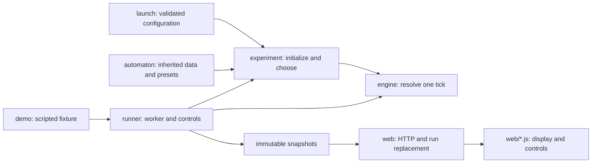

# Development reference

Read [README](../README.md) for the project and quick start, [MODEL](../MODEL.md) for behaviour, and [AGENTS](../AGENTS.md) for contribution rules. Commands run from the repository root. Issues and PRs hold priorities and verification evidence.

## Code map



| Change | Start here | Main regression coverage |
|---|---|---|
| FSM rows, responses, presets | `src/automaton.rs`, `src/experiment.rs` | `tests/automaton.rs`, chooser unit tests |
| Tick resolution, identity, integrity | `src/engine.rs` | `tests/engine.rs`, `tests/maintenance.rs`, `tests/action_state.rs` |
| Scheduling and observation | `src/runner.rs` | `tests/runner.rs`, `tests/experiment.rs` |
| CLI | `src/launch.rs`, `src/bin/` | `tests/headless.rs`, `tests/automaton.rs` |
| HTTP/restart metadata | `src/web.rs`, `src/web/presets.rs` | `tests/web.rs`, web unit tests |
| Browser workspace | `web/app.js`, `web/display.js`, `web/automaton.js`, `web/style.css` | `tests/browser/`, `tests/*.test.js` |

An agent stores one ordinary `Automaton` struct and mutable integrity/last selection. `Weights` is one four-value row inside that graph. There is no alternate autonomous strategy or optional graph. The engine accepts ordinary proposals independently of the chooser; `World::new` supports the no-maintenance scripted fixture, while autonomous worlds use `World::with_maintenance`.

Keep behaviour in the Rust chooser/engine. The browser draws the server's exact tickets and must not reimplement decision rules. No mutation, energy accounting, generic property framework or behaviour-mode layer exists yet. Do not introduce abstractions for those future features before a concrete need.

## Running options

```sh
cargo run --locked --features web --bin web
cargo run --locked --no-default-features --bin headless -- --seed 42 --ticks 500
cargo run --locked --features web --bin web -- --automaton-preset copy-bursts --width 64 --height 48 --occupancy 0.05
cargo run --locked --no-default-features --bin headless -- --mode demo --ticks 5
```

Default CLI mode is **autonomous**: 32 x 24, occupancy 0.3, mixed FSMs in equal shares, seed 1 and 500 ticks. Web starts paused, paced at 100 ms per tick; headless runs without pacing. Explicit demo mode defaults to five ticks; 0 reports its initial fixture and requests past 5 add all-wait ticks.

| Option | Meaning |
|---|---|
| `--mode autonomous\|demo` | Choose the autonomous model or scripted fixture |
| `--width N --height N` | Each at least 3; total at most 262,144 squares |
| `--occupancy 0..1` | At most six fractional digits; population rounds down |
| `--seed N --ticks N` | Nonnegative u64 values |
| `--automaton-preset mixed\|movement-runs\|repair-cycles\|copy-bursts\|wait-cycles` | Four graphs or a single graph |
| `--automata "INITIAL[~COPY_GAIN,MOVE_GAIN]:ROW/ROW/ROW/ROW;..."` | Custom graphs; four Wait,Move,Copy,Repair weights per row |
| `--proportions N,...` | One nonnegative u32 per graph; omitted means equal shares |
| `--integrity N` | Positive u32 maximum, initial and newborn integrity (10) |
| `--upkeep N --crowding-threshold N --crowding-upkeep N` | Base 1, threshold 5 (0..8), surcharge 1 |
| `--move-wear N --copy-wear N --repair N` | Extra wear 1/2 and gross restoration 4; nonnegative u32 |
| `--port N` | Web only: loopback port 7878; 0 requests an available port |
| `--tick-ms N --sample-every N --running` | Web only: pacing 0..60000 ms, positive sampling cadence, start running |

Initial state uses lowercase `wait`, `move`, `copy` or `repair`. Gains are 0..255 and default to zero. Every row must have a positive total; zero entries omit inherited arrows. Custom graph and preset options are mutually exclusive. Model options are invalid in demo mode. Retired `--bundles` and `--survival` options are rejected; use historical Git revisions to replay those models.

Example deterministic cycle: `--automata "wait:0,1,0,0/0,0,0,1/1,0,0,0/1,0,0,0"`. Inherited arrows differ from effective probabilities: integrity, crowding and the no-choice fallback are defined in MODEL.

## Worker and observation

The worker owns the world and random generator on a normal thread. Commands apply at tick boundaries; acknowledged receipts describe the applied tick/status and accepted event totals. Single-step advances once only while paused, and completed runs cannot advance. Starting or restarting at zero ticks is completed immediately.

Snapshots are immutable and publication is bounded/nonblocking. Running samples may be dropped; paused/completed samples remain available. The HTTP collector caches the latest sample. Slow or disconnected browsers cannot stall simulation. Page history retains 128 samples, labels gaps and resets for a different run; it is not a recording/export system. Failure evidence is collected every tick in the engine, independently of snapshot cadence.

Ctrl+C stops and joins the worker and collector. Test the complete lifecycle, including joins and panic-time Drop, inside a helper thread with a completion-channel timeout. Socket/receipt timeouts alone do not guard teardown deadlocks.

## Local HTTP API

The optional `web` feature binds only to loopback. Only its own Host and same-origin browser requests are allowed. POST clients must supply Origin and JSON content type; request bodies are limited to 128 bytes. Connection handling is capped at 16, with a three-second request timeout. There are no production fixture-reset endpoints. CSP restricts scripts, styles and connections to the same origin.

- `GET /api/snapshot`: latest immutable snapshot, including width/height, tick, end tick, count, status, cells, accepted totals and bounded failure history.
- `POST /api/control`: JSON object `{"command":"pause"}`, `{"command":"resume"}` or `{"command":"step"}`. Unknown fields, duplicate fields, arrays and wrong types are invalid. A receipt acknowledges application; an HTTP timeout does not prove the command was not applied.
- `POST /api/restart`: exactly one decimal seed string (`{"seed":"42"}`) or `{"random":true}`, optionally a known `preset`. Autonomous only. Must include the current `X-VirtualLife-Run` header. Rebuilds from current settings, replaces the old worker/cache, rotates identity, starts paused at zero and clears page history/selection. Zero-tick runs stay completed.

Seeds cover all u64 values; leading zeros are canonicalized. Random restart draws eight bytes from OS randomness independently of simulation draws, then exposes the chosen seed for replay. Initialization/randomness failure retains the current run. Restart rejects missing/stale/duplicate run preconditions with 409. Control accepts an optional run precondition for local scripts; the browser always supplies it. Preconditions are checked after reading the request body, under the current-run lock.

Every allowed response carries an opaque 128-bit `X-VirtualLife-Run`, including responses from an older worker. It is not authentication or a simulation seed. An old collector writes only its own cache. The browser cannot let late snapshots/receipts roll back a newer run. Lost non-idempotent replies are reconciled by observation without automatic retries; mutation buttons remain locked while the outcome is unknown.

`experiment` is null for demo. Otherwise it includes seed, generator, protocol, version, occupancy, maintenance, groups and preset metadata. Each group has a complete `automaton`, name, proportion, initial count and count. Exact ordered graphs/proportions determine the preset label, not population outcomes. Cells reference their group and carry integrity, last selected action, effective source state, occupied neighbours, potential upkeep and `transition_tickets`. Fatal next upkeep has null tickets. Large integers and tickets are decimal strings; grid indices and u32 integrity remain numbers. The browser uses BigInt to label probabilities accurately.

The catalog in `src/web/presets.rs` has `mixed-automata` and the four individual graph IDs listed above. It derives graphs from the single `src/automaton.rs` catalog. Omitting `preset` on restart retains the effective graphs/proportions; choosing one resets only those properties to equal shares. The UI previews choices without posting until restart. Custom CLI graphs stay custom and are preserved by seed-only replay.

## Verification

```sh
cargo fmt --all -- --check
cargo clippy --locked --all-targets --no-default-features -- -D warnings
cargo clippy --locked --all-targets --features web -- -D warnings
cargo test --locked --no-default-features
cargo test --locked --release --no-default-features
cargo test --locked --features web
cargo test --locked --doc --no-default-features
cargo test --locked --doc --features web
cargo build --locked --features web --bin web
npm ci
npm run check
npx playwright install --with-deps chromium
npm run test:e2e
cargo install cargo-audit --version 0.22.2 --locked
cargo audit --file Cargo.lock
npm audit --audit-level=low
git diff --check
```

Run checks for affected code and supported modes. The CI workflow runs Linux quality/audit, Linux and Windows Rust tests, and fresh Chromium scenarios on both platforms. Review the steps and tested commit, not only the final badge. Tool versions are pinned in `rust-toolchain.toml`, package files and `.github/workflows/ci.yml`.

Engine tests cover worked transitions, atomic errors/exhaustion, identity/occupancy/counts, proposal permutation, upkeep/wear boundaries, repair caps, inherited graphs, fresh-child timing and bounded failure records. Chooser tests check exact tickets, all previous states, zero/odd/maximal weights, gains, damage and crowding, wrapped starting neighbours, skipped draws and destination order. Observation tests compare complete worlds/memory/failure evidence across cadence, saturation and disconnection.

Every Playwright scenario starts a fresh real Rust process. Restart API tests run inside those fresh fixtures; restart never substitutes for isolation. Browser checks cover graph arrows, exact API values, actual grid pixels/clicks, desktop/narrow/fractional layouts, keyboard focus, read-only disclosure, bounded history, controls/completion, same-run reconnect, process replacement, pending presets, full-u64/random replay, two-page sync and delayed/lost replies. Timing assertions wait for the relevant observable condition. Screenshots are separate visual evidence from geometry/API assertions.

Windows tests send real Ctrl+C through node-pty/ConPTY; Node's `child.kill('SIGINT')` force-terminates a Windows process and cannot validate graceful exit. Both platforms must exit cleanly inside the guard; forced cleanup fails the test. Node and browser packages are test tools, not runtime services. Document tests are invoked, though there are no executable documentation examples.

Keep evidence in the PR. Distinguish automated checks, independent review, visual inspection and Pierre's acceptance. Required browser coverage is Chromium on Linux/Windows; macOS, WebKit and manual assistive-technology acceptance are not established by these checks.

## Limits

The engine uses ordinary vectors and an ID-to-starting-square hash map: expected O(grid squares + proposals). The chooser adjusts four weights per survivor without allocation; group counting is O(occupants x configured groups), capped at eight groups. These are algorithmic bounds, not frame-rate guarantees. `cargo run --release --example chooser_timing` measures choice passes on unchanged full grids, excluding transition resolution, HTTP and rendering.

There is no mutation, energy/material account, neighbour-property response, live world editing, persistence, export, cloud deployment or generic property framework yet. Repair costs only its action opportunity. Page-local observations are lost on refresh; process termination loses the run.

Age-based mortality is excluded by the [survival principle](../MODEL.md#survival-and-death-as-outcomes), not a missing feature to add later. Current failure is the explicit integrity/upkeep/wear approximation. Repair has no material budget and can sustain some individuals indefinitely; lifetime observations must not silently become lifespan enforcement.

The next model must [conserve material through recycling](../MODEL.md#finite-resources-and-conserved-material), including after an individual fails. The current engine removes failed individuals and does not retain or account for their material; existing integrity tests do not establish material conservation.

## Historical references

The native viewer and browser migration are recorded in [PR #2](https://github.com/ppericard/virtual-life/pull/2) and [PR #4](https://github.com/ppericard/virtual-life/pull/4). Detailed execution history and preserved branch tips remain in the [pre-cleanup README](https://github.com/ppericard/virtual-life/blob/9ca715a77965d9a8d4dee4a79f2a0d5a3fef5d4c/README.md#continuity-and-contribution) and Git history, not a rolling log here.

Historical branches are references, not development bases. Retiring the native viewer did not establish that its old build problem was fixed. Repeated activation, same-tick newborn activation and acting after expiry in the original Python were bugs; display coupling was unfinished implementation. Do not restore them as model rules.
